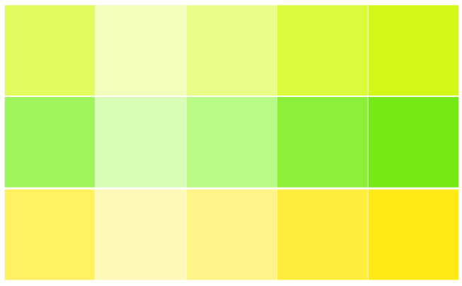

#  Color Palette by Paletton.com
Palette URL: http://paletton.com/#uid=5270u0kjXPi8LYaeYU2omJvtdC9

## Primary color:

- shade 0 = #E1FC5F = rgb(225,252, 95) = rgba(225,252, 95,1) = rgb0(0.882,0.988,0.373)
- shade 1 = #F2FEB9 = rgb(242,254,185) = rgba(242,254,185,1) = rgb0(0.949,0.996,0.725)
- shade 2 = #E9FD87 = rgb(233,253,135) = rgba(233,253,135,1) = rgb0(0.914,0.992,0.529)
- shade 3 = #DAFA3C = rgb(218,250, 60) = rgba(218,250, 60,1) = rgb0(0.855,0.98,0.235)
- shade 4 = #D1F816 = rgb(209,248, 22) = rgba(209,248, 22,1) = rgb0(0.82,0.973,0.086)

## Secondary color (1):

- shade 0 = #A1F55C = rgb(161,245, 92) = rgba(161,245, 92,1) = rgb0(0.631,0.961,0.361)
- shade 1 = #D7FDB7 = rgb(215,253,183) = rgba(215,253,183,1) = rgb0(0.843,0.992,0.718)
- shade 2 = #B9F985 = rgb(185,249,133) = rgba(185,249,133,1) = rgb0(0.725,0.976,0.522)
- shade 3 = #8CF039 = rgb(140,240, 57) = rgba(140,240, 57,1) = rgb0(0.549,0.941,0.224)
- shade 4 = #75E914 = rgb(117,233, 20) = rgba(117,233, 20,1) = rgb0(0.459,0.914,0.078)

## Secondary color (2):

- shade 0 = #FFF160 = rgb(255,241, 96) = rgba(255,241, 96,1) = rgb0(1,0.945,0.376)
- shade 1 = #FFF9B9 = rgb(255,249,185) = rgba(255,249,185,1) = rgb0(1,0.976,0.725)
- shade 2 = #FFF488 = rgb(255,244,136) = rgba(255,244,136,1) = rgb0(1,0.957,0.533)
- shade 3 = #FFED3D = rgb(255,237, 61) = rgba(255,237, 61,1) = rgb0(1,0.929,0.239)
- shade 4 = #FFEA16 = rgb(255,234, 22) = rgba(255,234, 22,1) = rgb0(1,0.918,0.086)

Generated by Paletton.com (c) 2002-2014

## Palette screenshot as per Paletton.com

## Palette screenshot as per Inkscape implementation

## Edwina eyes - the real thing

